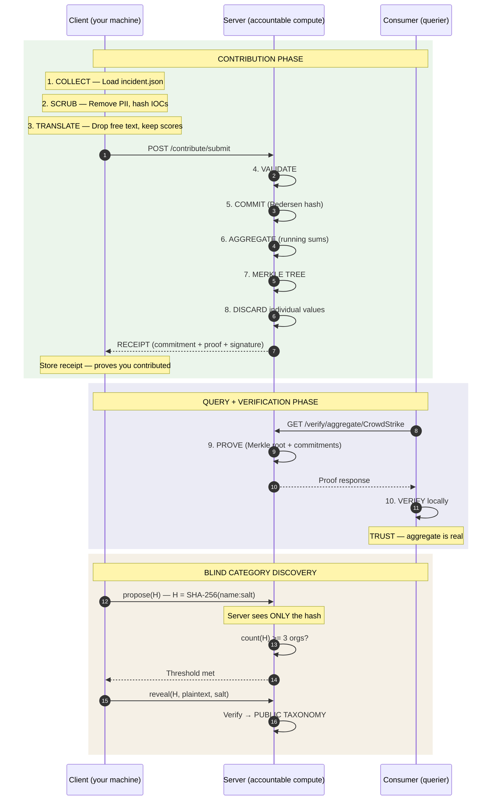

# Architecture — Detailed Three-Party Flow

## Sequence Diagram

## What Gets Stored vs Discarded

| Stored (server retains) | Discarded (gone after commit) |
|------------------------|------------------------------|
| Commitment hashes (SHA-256) | Individual scores |
| Running sums per vendor | Per-org attribution |
| Technique frequency counters | Free-text notes |
| Merkle tree of all commitments | Sigma rules, action strings |
| Blind category hashes (opaque) | Raw IOC values |
| Revealed category names | Who proposed what (until reveal) |
| Eval dimension aggregates (price, support, detection) | Raw dollar amounts, individual SLA times |

## Regulatory Compliance

See [COMPLIANCE.md](COMPLIANCE.md) for the full legal analysis covering CIRCIA, NERC CIP, SEC 8-K, state breach laws, and CISA 2015 safe harbor protections.
