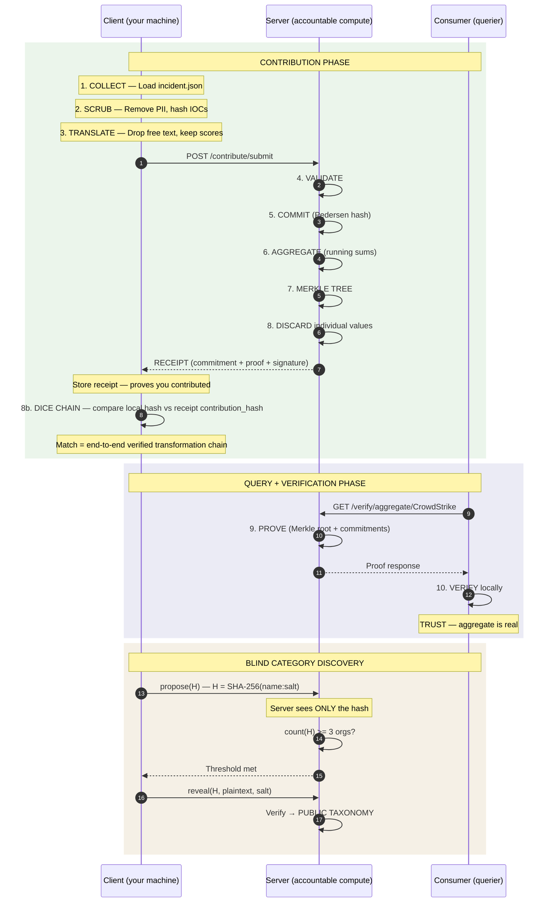

# Architecture — Detailed Three-Party Flow

> **The Blind for security — give one eval, get forty back.** nur is a social network for security intelligence. Product = protocol + users. The trustless aggregation protocol below IS the core IP. Query data (threat models, IOCs, stacks) flows in. Response data (tool intel, remediation, pricing) flows back. The integration shares. The human gets remediation back. Math, not promises.

## Sequence Diagram

## ADTC to ProofEngine Dice Chain

The client computes SHA-256 of the canonical JSON payload *before* submission. The server's `ProofEngine.commit_contribution()` independently computes `contribution_hash` from the same canonical form. The receipt returns this hash. If they match, the entire transformation chain (extract, anonymize, DP, translate, commit) is verified end-to-end -- no data was altered in transit. This is the "dice chain" link between the Attested Data Transformation Chain (ADTC) and the ProofEngine.

## What Gets Stored vs Discarded

| Stored (server retains) | Discarded (gone after commit) |
|------------------------|------------------------------|
| Commitment hashes (SHA-256) | Individual scores |
| Running sums per vendor | Per-org attribution |
| Technique frequency counters | Free-text notes |
| Merkle tree of all commitments | Sigma rules, action strings |
| Blind category hashes (opaque) | Raw IOC values |
| Revealed category names | Who proposed what (until reveal) |
| Eval dimension aggregates (price, support, performance, decision) | Raw dollar amounts, individual SLA times |
| BDP credibility scores (behavioral) | Per-org credibility profiles |
| Dice chain hashes (contribution_hash) | Pre-submission payload content |

## Network Effect

10 users = interesting. 100 = useful. 1,000 = indispensable. The protocol enables trust. The users create value. At scale, switching cost is infinite — you'd lose the collective intelligence of every security team in your vertical.

### Network Analytics

Two dashboards track network health:

- **Public dashboard** (`/dashboard`) — contribution velocity, type breakdown, industry/category coverage, top techniques. All aggregate, no individual data.
- **Admin dashboard** (`/admin/dashboard`) — supply-side (contributions over time, by type/industry/org_size/role), demand-side (registrations, API usage, tier distribution), engagement funnel (registered → verified → contributed → queried → returned), viral coefficient (k-factor from invite system), and retention cohorts. Protected by `NUR_API_KEY`.

Demand-side tracking uses `APIRequestLog` (SHA-256 of API key, endpoint, timestamp) — no PII. Funnel tracking links contributions to API keys via `submitted_by_hash` (SHA-256, not reversible to email).

## Regulatory Compliance

See [COMPLIANCE.md](COMPLIANCE.md) for the full legal analysis covering CIRCIA, NERC CIP, SEC 8-K, state breach laws, and CISA 2015 safe harbor protections.
