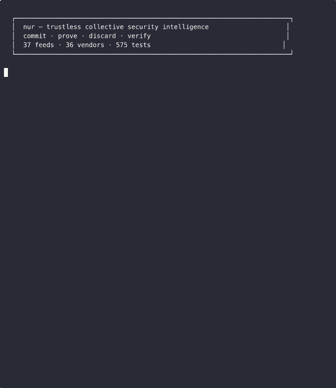

<h1 align="center">nur</h1>

<p align="center"><strong>Collective security intelligence for industries. Give data, get smarter.</strong></p>

<p align="center">Your industry should be smarter together than any single company is alone.</p>

<p align="center">
  
</p>

<p align="center">
  
  
  
  
  
  
</p>

---

Every hospital buys security tools based on vendor marketing. Every bank figures out their detection gaps by getting hacked. Every energy company fights the same APT without knowing three other utilities already beat it.

nur fixes this. Two modes, one platform:

- **Wartime** — you're under attack. Upload IOCs, get campaign matches, remediation actions, detection gaps.
- **Peacetime** — build defenses. Market maps, vendor comparisons, threat modeling, stack coverage analysis.

> ✅ **Trustless architecture.** The server commits to every value, proves every aggregate, and discards individual data. Cryptographic receipts, Merkle proofs, and accountability chains. Your data can't be mined — math, not promises.

> 🟢 **Try it live:** [nur.saramena.us](https://nur.saramena.us) — [dashboard](https://nur.saramena.us/dashboard) · [docs](https://nur.saramena.us/guide) · [register](https://nur.saramena.us/register)

---

## Get started

```bash
pip install nur
nur init
nur register you@yourorg.com     # work email required, keypair generated
nur report incident.json          # give data, get intelligence
```

Or self-host:
```bash
git clone https://github.com/manizzle/nur.git && cd nur
nur up --vertical healthcare
```

---

## ⚔️ Wartime — incident response

```bash
nur report incident_iocs.json
```
```
  Campaign Match: Yes — 4 other healthcare orgs
  Shared IOCs: 32 · Threat Actor: LockBit

  Actions:
    [CRITICAL] Block C2 domains at firewall
    [CRITICAL] Deploy T1490 detection — your tools miss it
    [HIGH]     Hunt for RDP lateral movement

  What worked at other orgs:
    - Isolated RDP across all subnets (stopped_attack)
    - Deployed Sigma rule for vssadmin delete (stopped_attack)
```

Also: `nur report attack_map.json` for detection gaps, `nur report eval.json` for benchmarks.

---

## 🛡️ Peacetime — build defenses

```bash
# Evaluate tools — upload your eval, get benchmarks back
nur eval                                             # interactive walkthrough
nur eval --vendor crowdstrike                        # evaluate a specific tool
nur eval --file our_eval.json                        # submit from file

# Research & plan
nur market edr                                       # vendor rankings
nur search vendor crowdstrike                        # real scores, not Gartner
nur search compare crowdstrike sentinelone           # side-by-side
nur rfp crowdstrike sentinelone ms-defender           # procurement comparison

# Threat analysis
nur threat-map "ransomware" --tools crowdstrike      # coverage gaps
nur threat-model --stack crowdstrike,splunk,okta --vertical healthcare
nur patterns healthcare                              # attack methodology patterns
nur simulate --stack crowdstrike,splunk,okta --vertical healthcare
```

**Threat modeling** — generate MITRE-mapped threat models for your stack, compatible with [threatcl](https://github.com/threatcl/threatcl):

```
  Coverage: 75% (6/8 priority techniques)
  Gaps: T1566 Spearphishing → add email security
        T1048 Exfiltration → add NDR or DLP
  Compliance: HIPAA ✓ · NIST CSF ✓ · HITECH ✗
```

```bash
nur threat-model --stack crowdstrike,splunk --hcl --output model.hcl
threatcl validate model.hcl     # works with threatcl tool
```

---

## 🏥 The hospital scenario

**2:17 AM** — Ohio Children's Hospital. LockBit. EHR encrypted. NICU monitors offline.

```bash
nur report lockbit_iocs.json              # 32 shared IOCs. LockBit confirmed.
nur report lockbit_attack_map.json        # 7 detection gaps. T1490 critical.
nur threat-model --stack crowdstrike,splunk --vertical healthcare  # 75% coverage, 2 gaps
```

**4:30 AM** — West Virginia gets the same ransom note. Their report is *better* — because Ohio contributed.

---

## 📡 37 data sources · 36 vendors · 658,000+ IOCs

```bash
nur scrape --list       # all sources
nur admin sources       # all 45 with tier/status
```

**IOC Feeds (20):** ThreatFox, Feodo, MalwareBazaar, URLhaus, SSL Blacklist, CISA KEV, NVD, FireHOL, IPsum, OpenPhish, Emerging Threats, Dataplane, Spamhaus DROP, DigitalSide, CINS, BruteForceBlocker, AbuseIPDB, OTX, Pulsedive, GreyNoise

**Vendor Intelligence (15):** MITRE ATT&CK Evals, AV-TEST, SE Labs, AV-Comparatives, CISA KEV vendors, Reddit, Hacker News, Stack Exchange, G2, Gartner, PeerSpot, Capterra, TrustRadius, GitHub, Vendor Metadata

**Vendors (36):** CrowdStrike, SentinelOne, Microsoft Defender, Cortex XDR, Carbon Black, Sophos, Bitdefender, ESET, Trend Micro, Kaspersky, Splunk, Sentinel, QRadar, Elastic, Wiz, Prisma Cloud, Snyk, Okta, Entra ID, CyberArk, BeyondTrust, Vault, Proofpoint, Mimecast, Zscaler, Cloudflare, Cisco Duo, Tenable, Qualys, Rapid7, Cloudflare WAF, F5, Imperva, Darktrace, Vectra, Recorded Future

> **Run a threat intel feed?** [Get listed](https://github.com/manizzle/nur/issues/4). Premium feed access? [What we need](https://github.com/manizzle/nur/issues/5).

---

## 💰 Pricing

| | Community | Pro | Enterprise |
|---|---|---|---|
| **Price** | Free | $99/mo | $499/mo |
| Contribute data | ✓ | ✓ | ✓ |
| Your percentile position | ✓ | ✓ | ✓ |
| Cryptographic receipts | ✓ | ✓ | ✓ |
| Market maps + vendor rankings | | ✓ | ✓ |
| Threat maps + coverage analysis | | ✓ | ✓ |
| Attack simulation | | ✓ | ✓ |
| Vendor side-by-side comparison | | ✓ | ✓ |
| API access | | | ✓ |
| Vendor intelligence dashboard | | | ✓ |
| Compliance reports | | | ✓ |
| RFP generation | | | ✓ |
| Priority support | | | ✓ |

```bash
# Free tier — contribute and see your position
nur eval --vendor crowdstrike
# → "Your score: 9.2 — 73rd percentile across 42 evaluations"

# Pro tier — full intelligence
nur market edr                    # vendor rankings
nur threat-map "ransomware"       # MITRE coverage gaps
nur simulate --stack crowdstrike  # attack simulation
```

> **For vendors:** Enterprise tier includes the Vendor Intelligence Dashboard — see how practitioners rate your product, technique-level detection gaps, and category ranking with cryptographic proof of methodology. Contact us for details.

---

## 🏗️ Deploy for your industry

```bash
nur up --vertical healthcare     # LockBit, HIPAA
nur up --vertical financial      # APT28, PCI DSS
nur up --vertical energy         # Sandworm, NERC CIP
nur up --vertical government     # APT29, FISMA
```

**Docker:**
```bash
curl -sSL https://raw.githubusercontent.com/manizzle/nur/main/install.sh | bash
```

**Your users:**
```bash
pip install nur && nur init && nur register you@org.com
```

---

## 🔌 Integrate anywhere

**10 integration points:**

```bash
# SIEM / EDR
nur integrate splunk                   # forward alerts from Splunk
nur integrate sentinel                 # forward incidents from Microsoft Sentinel
nur integrate crowdstrike              # forward detections from CrowdStrike

# Syslog / Webhook
nur integrate syslog --port 1514       # listen for CEF/syslog events
# POST to /ingest/webhook              # universal webhook endpoint

# Import
nur import navigator layer.json        # MITRE ATT&CK Navigator layers
nur import stack inventory.csv         # asset inventory / tool inventory
nur import compliance soc2.json        # compliance framework mappings
nur import rfp responses.json          # vendor RFP responses

# Export
nur export stix                        # export as STIX 2.1
nur export misp                        # export as MISP events
```

**Python:**
```python
from nur import load_file, anonymize, submit
data  = load_file("incident.json")
clean = [anonymize(d) for d in data]
[submit(c, api_url="https://nur.saramena.us") for c in clean]
```

**CLI + JSON:**
```bash
nur report incident.json --json | jq '.intelligence.actions'
nur threat-model --stack crowdstrike --hcl > model.hcl
```

**API:**

| Endpoint | What | Tier |
|----------|------|------|
| `POST /analyze` | Give data → get intelligence + receipt | Free |
| `POST /threat-model` | Generate threat model for stack | Pro |
| `POST /register` | Register with work email + public key | Free |
| `GET /pricing` | Tier definitions and features | Free |
| `GET /my-tier` | Check your current tier | Free |
| `GET /my-position/{vendor}` | Your percentile vs the market | Free |
| `GET /intelligence/market/{cat}` | Vendor market map | Pro |
| `POST /intelligence/threat-map` | MITRE coverage gaps | Pro |
| `GET /intelligence/danger-radar` | Hidden vendor risks | Pro |
| `GET /intelligence/patterns/{vertical}` | Attack methodology patterns | Pro |
| `POST /intelligence/simulate` | Simulate attack chain | Pro |
| `GET /search/vendor/{name}` | Vendor scores | Pro |
| `GET /search/compare?a=X&b=Y` | Side-by-side comparison | Pro |
| `GET /vendor-dashboard/{vendor}` | Vendor intelligence dashboard | Enterprise |
| `GET /dashboard` | Visual dashboard | Free |
| `GET /guide` | Documentation | Free |

---

## 🔐 Trustless Architecture

In the age of AI data mining, nur is designed so your data **cannot be mined, sold, or misused** — not because we promise, but because the math makes it impossible.

**The server is on a cryptographic leash:**

```
CONTRIBUTOR (your machine)              SERVER (accountable compute)
──────────────────────────              ────────────────────────────
1. Anonymize + scrub locally
2. All fields are numeric/categorical
   (no free text — structured data)
3. Send anonymized contribution         4. Validate + commit (Pedersen hash)
                                        5. Add commitment to Merkle tree
                                        6. Update running aggregate sums
                                        7. DISCARD individual values
                                        8. Store ONLY: commitments + aggregates

RECEIPT returned to you:                On query:
  - Commitment hash (sealed value)       - Return aggregate + proof chain
  - Merkle inclusion proof               - Merkle root, N contributors,
  - Server signature                       commitment-verified computation
```

**What the server retains:** commitment hashes (opaque SHA-256), running sums per vendor, Merkle tree. **Zero individual scores, zero technique lists, zero per-org attribution.**

**Crypto primitives:**

| Primitive | What it does | What breaks without it |
|-----------|-------------|----------------------|
| **Pedersen Commitments** | Seals each value — server can't change it after receipt | Server could alter scores to favor vendors |
| **Merkle Tree** | Binds all commitments — server can't add/remove contributions | Server could inflate N ("500 orgs trust us") or exclude low scores |
| **ZKP Range Proofs** | Proves score is in [0, 10] without revealing it | Poisoner submits score=99999, corrupts aggregate |
| **Contribution Receipts** | Proves your data was included correctly | Server could silently drop your contribution |
| **Aggregate Proofs** | Proves computation is correct against commitment chain | Server could fabricate rankings |
| **Secure Histograms** | Technique frequency from binary vector sums | Server would need plaintext technique lists |
| **BDP Credibility** | Behavior-based lie detection for data poisoning | Competitor creates 100 fake accounts, rates rivals 0/10 |
| **Platform Attestation** | Proves "N real contributions from M orgs" with Merkle proof | Platform claims 500 orgs but has 3 contributions |

**Security hardening:**

- **Work email required** — gmail/yahoo/disposable blocked
- **Keypair auth** — private key never leaves your machine
- **Signed requests** — replay prevention (5-min window)
- **Rate limiting** — 60 req/min (community), 600 (pro), 6000 (enterprise)
- **Min-k enforcement** — no aggregates with < 3 contributors
- **Payload limits** — 10K IOCs, 500 techniques max
- **AWS Secrets Manager** — zero secrets in code

Full analysis: [THREAT_MODEL.md](THREAT_MODEL.md)

---

## 🔧 Admin

```bash
nur admin status         # health + feed freshness
nur admin sources        # all 45 data sources
nur admin db-stats       # detailed breakdown
nur admin export         # dump aggregated data
nur admin rotate-key     # new API key
```

---

## 🧪 Tests

```bash
pytest       # 519 tests
```

---

## 📄 License

| Component | License |
|-----------|---------|
| Code | [Apache 2.0](LICENSE) |
| Data | [CDLA-Permissive-2.0](DATA_LICENSE.md) |
| Feeds | CC0 (abuse.ch) · Public Domain (CISA) · Apache 2.0 (MITRE) |
