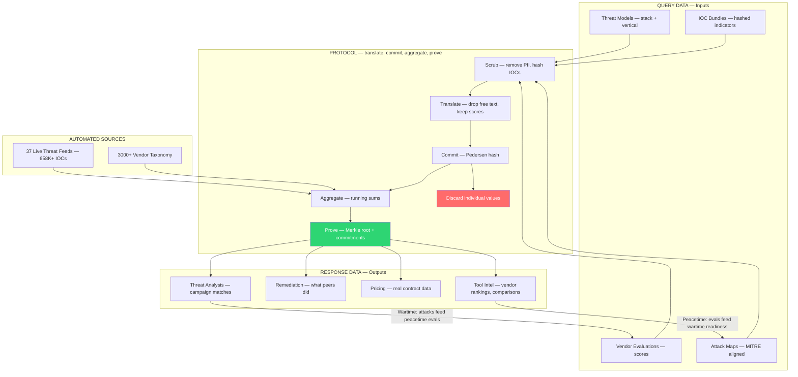

# Data Flow

Query Data (what you input) through the trustless protocol to Response Data (what you get back).

```mermaid
graph TB
    subgraph "QUERY DATA — Inputs"
        TM[Threat Models — stack + vertical]
        IOC[IOC Bundles — hashed indicators]
        EVAL[Vendor Evaluations — scores]
        AM[Attack Maps — MITRE aligned]
    end

    subgraph "PROTOCOL — translate, commit, aggregate, prove"
        SCRUB[Scrub — remove PII, hash IOCs]
        TRANSLATE[Translate — drop free text, keep scores]
        COMMIT[Commit — Pedersen hash]
        AGG[Aggregate — running sums]
        PROVE[Prove — Merkle root + commitments]
        DISCARD[Discard individual values]
    end

    subgraph "RESPONSE DATA — Outputs"
        TOOL[Tool Intel — vendor rankings, comparisons]
        REM[Remediation — what peers did]
        PRICE[Pricing — real contract data]
        THREAT[Threat Analysis — campaign matches]
    end

    subgraph "AUTOMATED SOURCES"
        FEEDS[37 Live Threat Feeds — 658K+ IOCs]
        TAX[3000+ Vendor Taxonomy]
    end

    TM --> SCRUB
    IOC --> SCRUB
    EVAL --> SCRUB
    AM --> SCRUB
    FEEDS --> AGG
    TAX --> AGG

    SCRUB --> TRANSLATE
    TRANSLATE --> COMMIT
    COMMIT --> AGG
    AGG --> PROVE
    COMMIT --> DISCARD

    PROVE --> TOOL
    PROVE --> REM
    PROVE --> PRICE
    PROVE --> THREAT

    TOOL -->|"Peacetime: evals feed wartime readiness"| AM
    THREAT -->|"Wartime: attacks feed peacetime evals"| EVAL

    style DISCARD fill:#ff6b6b,color:#fff
    style PROVE fill:#2ed573,color:#fff
```
