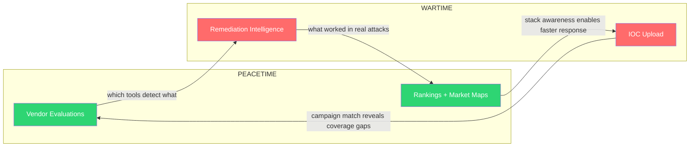

# Peacetime / Wartime Flywheel

Peacetime data feeds wartime response. Wartime incidents feed peacetime intelligence. Neither works alone.

```mermaid
graph LR
    subgraph "PEACETIME"
        EVAL[Vendor Evaluations]
        RANK[Rankings + Market Maps]
    end

    subgraph "WARTIME"
        IOC[IOC Upload]
        REM[Remediation Intelligence]
    end

    EVAL -->|"which tools detect what"| REM
    REM -->|"what worked in real attacks"| RANK
    IOC -->|"campaign match reveals coverage gaps"| EVAL
    RANK -->|"stack awareness enables faster response"| IOC

    style EVAL fill:#2ed573,color:#fff
    style RANK fill:#2ed573,color:#fff
    style IOC fill:#ff6b6b,color:#fff
    style REM fill:#ff6b6b,color:#fff
```
