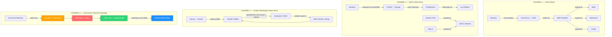

# Go-to-Market Channels

Four channels, staggered by timing, building toward network effect moat.

```mermaid
graph TB
    subgraph "CHANNEL 1 — Direct (Now)"
        M1[Murtaza] -->|15-min demo| YE[Yusuf Ezzy — CISO]
        YE -->|$10K via| WWT[WWT Reseller]
        WWT -->|expand to| BOFA[BofA]
        WWT -->|expand to| ALB[Albertsons]
        WWT -->|expand to| PGE[PG&E]
    end

    subgraph "CHANNEL 2 — ISACs (Near-term)"
        M2[Murtaza] -->|outreach via Yusuf/Jeff| EISAC[E-ISAC — Energy]
        EISAC -->|voice sessions| PRAC[Practitioners]
        PRAC -->|seed data on| PLAT[nur Platform]
        RV[Rachel GTM] -->|pointed at| ISACS[ISACs General]
        NK[Nika K] -->|pointed at| ISACS
    end

    subgraph "CHANNEL 3 — Vendor Marketplace (Near-term)"
        CANARY[Canary — Rachel] -->|claims profile| VP[Vendor Profiles]
        VP -->|practitioners see scores + demos| EVAL[Evaluation Traffic]
        EVAL -->|vendors want in| MORE[More Vendor Listings]
        MORE --> VP
    end

    subgraph "CHANNEL 4 — Community Flywheel (Ongoing)"
        INVITE[Invite-only Referrals]
        INVITE -->|peer trust| TEN[10 users = interesting]
        TEN --> HUNDRED[100 users = useful]
        HUNDRED --> THOUSAND[1000 users = indispensable]
        THOUSAND -->|switching cost infinite| MOAT[Network Effect Moat]
    end

    style TEN fill:#ffa502,color:#fff
    style HUNDRED fill:#ff6b6b,color:#fff
    style THOUSAND fill:#2ed573,color:#fff
    style MOAT fill:#1e90ff,color:#fff
```
