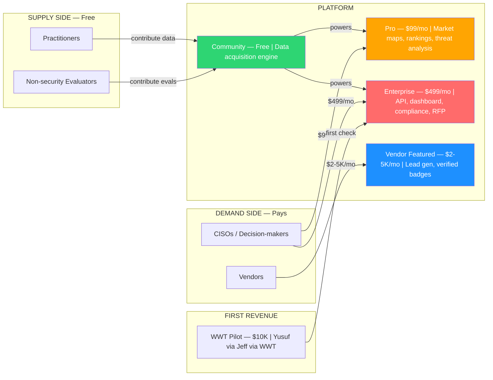

# Revenue Model

Supply side contributes free. Demand side pays. The marketplace.

```mermaid
graph LR
    subgraph "SUPPLY SIDE — Free"
        P[Practitioners]
        NONSEC[Non-security Evaluators]
    end

    subgraph "PLATFORM"
        FREE["Community — Free | Data acquisition engine"]
        PRO["Pro — $99/mo | Market maps, rankings, threat analysis"]
        ENT["Enterprise — $499/mo | API, dashboard, compliance, RFP"]
        VFL["Vendor Featured — $2-5K/mo | Lead gen, verified badges"]
    end

    subgraph "DEMAND SIDE — Pays"
        CISO[CISOs / Decision-makers]
        VEND[Vendors]
    end

    subgraph "FIRST REVENUE"
        WWT_PILOT["WWT Pilot — $10K | Yusuf via Jeff via WWT"]
    end

    P -->|contribute data| FREE
    NONSEC -->|contribute evals| FREE
    FREE -->|powers| PRO
    FREE -->|powers| ENT

    CISO -->|$99/mo| PRO
    CISO -->|$499/mo| ENT
    VEND -->|$2-5K/mo| VFL

    WWT_PILOT -->|first check| ENT

    style FREE fill:#2ed573,color:#fff
    style PRO fill:#ffa502,color:#fff
    style ENT fill:#ff6b6b,color:#fff
    style VFL fill:#1e90ff,color:#fff
```
