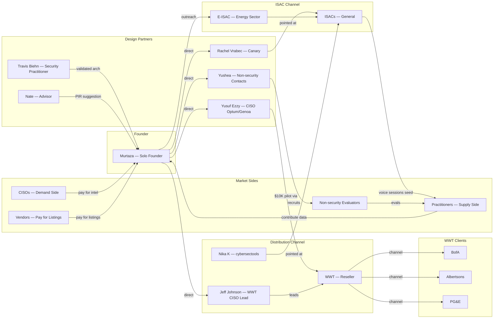

# Stakeholder Map

Who is connected to whom, how, and why.

```mermaid
graph LR
    subgraph Founder
        M[Murtaza — Solo Founder]
    end

    subgraph "Design Partners"
        YE[Yusuf Ezzy — CISO Optum/Genoa]
        TB[Travis Biehn — Security Practitioner]
        RV[Rachel Vrabec — Canary]
        N[Nate — Advisor]
        Y[Yushea — Non-security Contacts]
    end

    subgraph "Distribution Channel"
        JJ[Jeff Johnson — WWT CISO Lead]
        WWT[WWT — Reseller]
        NK[Nika K — cybersectools]
    end

    subgraph "ISAC Channel"
        EISAC[E-ISAC — Energy Sector]
        ISACs[ISACs — General]
    end

    subgraph "WWT Clients"
        BOFA[BofA]
        ALB[Albertsons]
        PGE[PG&E]
    end

    subgraph "Market Sides"
        SUPPLY[Practitioners — Supply Side]
        DEMAND[CISOs — Demand Side]
        VENDORS[Vendors — Pay for Listings]
        NONSEC[Non-security Evaluators]
    end

    M -->|direct| YE
    M -->|direct| JJ
    M -->|direct| Y
    M -->|direct| RV
    M -->|outreach| EISAC

    YE -->|$10K pilot via| WWT
    JJ -->|leads| WWT
    WWT -->|channel| BOFA
    WWT -->|channel| ALB
    WWT -->|channel| PGE

    RV -->|pointed at| ISACs
    NK -->|pointed at| ISACs
    EISAC --> ISACs
    ISACs -->|voice sessions seed| SUPPLY

    TB -->|validated arch| M
    N -->|PIR suggestion| M

    Y -->|recruits| NONSEC
    NONSEC -->|evals| SUPPLY

    SUPPLY -->|contribute data| M
    DEMAND -->|pay for intel| M
    VENDORS -->|pay for listings| M
```
